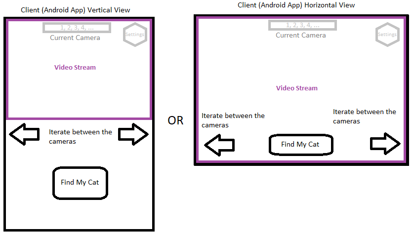

# Find My Cat Project

## Summary

This is a Mobile-Client & Minicomputer-Server application designed to track cats using cameras.

## Brainstorm (Initial Idea)

### Client

A simple Android Native app that displays live video feeds featuring a specific cat.
It should also include a settings window for configuration purposes.

### Server

A Raspberry Pi-hosted server that manages all video streams multiple cameras and identifies which video contains a cat. 
The selected video will then be transmitted to the app.

## Inspiration

- My beloved wife and her passion for our cat.

## Client App Mockup

## Related Works

- https://gist.github.com/mendaparadarshit/b1cd7fce2fa4ad83f991775e85e85989
- https://gstreamer.freedesktop.org/
- https://www.reddit.com/r/cpp_questions/comments/152k7jk/what_is_the_best_way_to_create_an_isolated_c/ (Basically use CMake)
- https://www.reddit.com/r/selfhosted/comments/wci8ga/what_cheap_cameras_for_home_security_that_dont/
- https://www.reddit.com/r/homeassistant/comments/11l7ddm/looking_for_a_cheap_couple_of_indoor_security/
- https://medium.com/@ryanburnsworth/building-a-remote-communication-android-app-using-jni-and-kotlin-79becb4b5ab5
- https://github.com/drogonframework/drogon